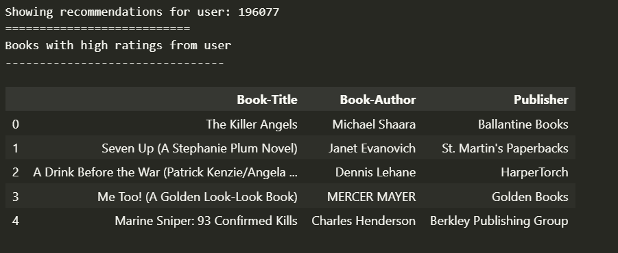
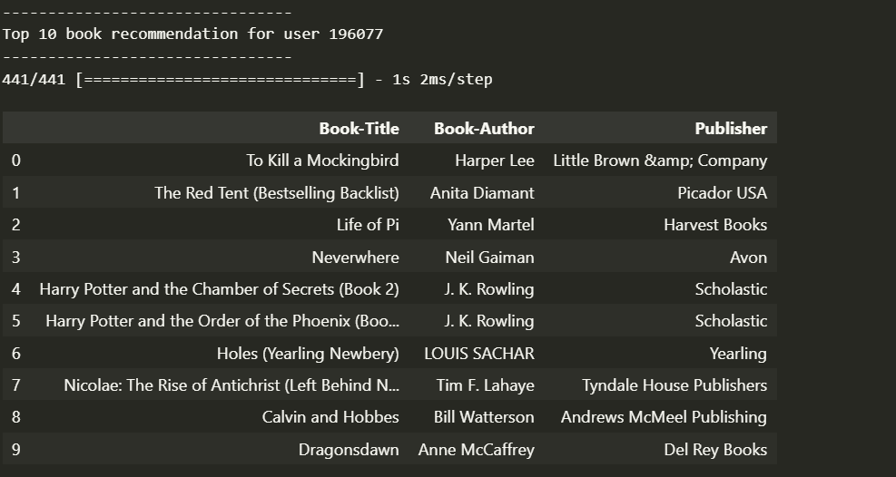

# Book Recommendation System - Rafael Siregar

## Project Overview

Sistem rekomendasi buku sangat penting di era digital, di mana pengguna dihadapkan pada ribuan pilihan buku dan sering kesulitan menemukan bacaan yang sesuai minat. Sistem rekomendasi dapat meningkatkan pengalaman pengguna, efisiensi pencarian, dan keterlibatan pada platform. Studi oleh Ricci et al. (2011) menunjukkan sistem rekomendasi meningkatkan kepuasan pengguna dan membantu pengambilan keputusan di berbagai domain, termasuk literatur dan e-commerce.

**Referensi:**

Ricci, F., Rokach, L., Shapira, B., & Kantor, P. B. (2011). *Recommender Systems Handbook*. Springer.

---

## Business Understanding

### Problem Statements

- Bagaimana membantu pengguna menemukan buku yang sesuai preferensi di antara ribuan pilihan?
- Bagaimana memberikan rekomendasi relevan untuk pengguna baru (cold start) maupun lama?
- Bagaimana mengukur dan meningkatkan kualitas rekomendasi yang diberikan sistem?

### Goals

- Mengembangkan sistem rekomendasi buku yang mampu memberikan saran buku relevan sesuai minat pengguna.
- Mengimplementasikan dua pendekatan sistem rekomendasi (content-based filtering dan collaborative filtering) untuk membandingkan efektivitasnya.
- Mengevaluasi performa sistem rekomendasi menggunakan metrik yang sesuai agar dapat terus ditingkatkan.

### Solution Approach

-**Content-Based Filtering (CBF):** Sistem merekomendasikan buku berdasarkan kemiripan konten (judul, penulis) dengan buku yang pernah disukai pengguna.

-**Collaborative Filtering (CF):** Sistem merekomendasikan buku berdasarkan pola interaksi dan rating pengguna lain yang memiliki preferensi serupa.

---

## Data Understanding

Dataset yang digunakan berasal dari [Kaggle Book Recommendation Dataset](https://www.kaggle.com/datasets/arashnic/book-recommendation-dataset), terdiri dari tiga file utama: Books.csv, Ratings.csv, dan Users.csv.

**Jumlah Data (berdasarkan output notebook):**

- Buku: 271.360 entri
- Rating: 1.149.780 entri
- User: 278.858 entri

**Fitur pada Dataset:**

-**Books.csv**

- ISBN: Kode unik buku
- Book-Title: Judul buku
- Book-Author: Penulis buku
- Year-Of-Publication: Tahun terbit
- Publisher: Penerbit
- Image-URL-S/M/L: URL gambar sampul buku

-**Ratings.csv**

- UserId: ID pengguna
- ISBN: Kode unik buku
- Book-Rating: Rating yang diberikan (0-10)

-**Users.csv**

- UserId: ID pengguna
- Location: Lokasi pengguna
- Age: Umur pengguna

**Kondisi Data:**

- Terdapat missing value pada beberapa kolom (Book-Author, Publisher, Image-URL-L, Age).
- Banyak rating 0 pada Ratings.csv (lebih dari 50%), yang tidak merepresentasikan penilaian sebenarnya.
- Jumlah ISBN unik pada ratings lebih banyak dari books, sehingga perlu penyelarasan data.
- Data telah dieksplorasi untuk melihat distribusi rating, aktivitas user, dan kelengkapan fitur.

**Exploratory Data Analysis (EDA):**

- Distribusi rating sangat tidak seimbang, mayoritas rating adalah 0.
- Banyak user dan buku hanya memiliki sedikit interaksi.
- Visualisasi dan analisis dilakukan untuk melihat distribusi rating, jumlah buku unik, dan aktivitas user.
- Ditemukan banyak rating 0, sehingga dihapus pada tahap preprocessing.

---

## Data Preparation

Tahapan data preparation yang dilakukan secara berurutan:

1.**Penggabungan Data:**

   Menggabungkan data buku dan rating untuk membentuk satu dataframe utama yang hanya memuat kolom relevan: UserId, ISBN, Book-Rating, Book-Title, Book-Author, Publisher.

2.**Pembersihan Data:**

- Menghapus nilai kosong (NaN) pada kolom penting.
- Menghapus baris dengan rating 0 agar model hanya belajar dari interaksi bermakna.
- Menghapus kolom yang tidak relevan seperti ISBN, Year-Of-Publication, Image-URL-S, Image-URL-M.
- Membersihkan nama judul buku dari karakter non-alfabet agar konsisten.

3.**Feature Engineering:**

- Membuat fitur gabungan (`all_features`) dari judul dan penulis buku untuk content-based filtering.

4.**Reduksi Duplikasi:**

- Menghapus duplikasi berdasarkan judul buku agar setiap judul hanya muncul satu kali pada proses CBF.

5.**TF-IDF Vectorization:**

- Melakukan ekstraksi fitur pada kolom `all_features` menggunakan TF-IDF Vectorizer dan CountVectorizer (unigram+bigram), lalu menggabungkan hasilnya. Matriks hasil ini digunakan untuk menghitung kemiripan antar buku pada sistem content-based filtering.

```python

   tfidf = TfidfVectorizer()

   tfidf_matrix = tfidf.fit_transform(df_unique['all_features'])

   count_vect = CountVectorizer(ngram_range=(1,2), min_df=2)

   count_matrix = count_vect.fit_transform(df_unique['all_features'])

   combined_matrix = hstack([tfidf_matrix, count_matrix])

```

6.**Encoding:**

- Melakukan encoding pada ISBN dan UserId agar dapat digunakan pada model embedding collaborative filtering.

```python

   isbn_ids = df_tf['ISBN'].unique().tolist()

   isbn_to_encoded = {x: i for i, x inenumerate(isbn_ids)}

   encoded_to_isbn = {i: x for i, x inenumerate(isbn_ids)}

   df_tf['ISBN'] = df_tf['ISBN'].map(isbn_to_encoded)

```

7.**Balancing Data:**

- Mengambil sampel seimbang untuk setiap kelas rating (5-10) agar model tidak bias.

8.**Split Data:**

- Membagi data menjadi data latih dan data uji (80:20) untuk evaluasi model.

---

## Modeling & Results

### Content-Based Filtering (CBF)

- Menggunakan TF-IDF dan CountVectorizer pada fitur gabungan judul dan penulis buku.
- Menghitung kemiripan antar buku menggunakan cosine similarity.
- Rekomendasi diberikan berdasarkan kemiripan konten dengan buku yang dipilih user.
- Skor akhir rekomendasi merupakan kombinasi similarity dan rata-rata rating buku.
- Fungsi rekomendasi menerima judul buku sebagai input dan mengembalikan daftar buku paling mirip (Top-10).

**Contoh Output Top-10 Rekomendasi (CBF) untuk 'A Gracious Plenty A Novel':**


### Collaborative Filtering (CF)

- Menggunakan model neural network dengan embedding untuk ISBN dan UserId.
- Model belajar dari pola interaksi user-buku untuk memprediksi rating.
- Rekomendasi diberikan berdasarkan prediksi rating tertinggi untuk buku yang belum pernah dibaca user.
- Data rating diseimbangkan agar model tidak bias ke rating tertentu.
- Model menggunakan dua embedding layer (user dan buku), bias, dan output sigmoid (rating dinormalisasi).
- Model dievaluasi menggunakan Root Mean Squared Error (RMSE) pada data validasi.

**Contoh Output 5 Rekomendasi dari Cf untuk user 196077 berdasarkan behavior user-buku**



**Contoh Output Top-10 Rekomendasi (CF) untuk user 196077:**



#### Kelebihan & Kekurangan

-**CBF:**

+ Kelebihan: Tidak membutuhkan data interaksi user lain, cocok untuk cold start.
+ Kekurangan: Hanya merekomendasikan buku yang mirip secara konten, tidak bisa menangkap pola preferensi kolektif.

-**CF:**

+ Kelebihan: Dapat menangkap pola kompleks antar user dan item, hasil rekomendasi lebih personal.
+ Kekurangan: Membutuhkan data interaksi yang cukup banyak, cold start untuk user/item baru.

---

## Evaluation

### Metrik Evaluasi yang Digunakan

Untuk memastikan sistem rekomendasi benar-benar membantu pengguna menemukan buku sesuai preferensi, memberikan rekomendasi relevan untuk pengguna baru maupun lama, serta dapat diukur dan ditingkatkan kualitasnya, digunakan dua metrik evaluasi utama yang sesuai dengan pendekatan dan tujuan sistem:

1.**Root Mean Squared Error (RMSE)** untuk Collaborative Filtering

2.**Precision@10** untuk Content-Based Filtering

---

### 1. Collaborative Filtering

**Metrik:**
Root Mean Squared Error (RMSE)

**Penjelasan:**
RMSE mengukur seberapa akurat model dalam memprediksi rating yang akan diberikan user terhadap buku yang belum pernah dibaca. Dengan RMSE yang rendah, sistem dapat memberikan rekomendasi yang lebih personal dan relevan, baik untuk pengguna lama maupun pengguna baru yang sudah memiliki beberapa interaksi.

**Formula:**

$$
\text{RMSE} = \sqrt{\frac{1}{n} \sum_{i=1}^{n} (y_{\text{true},i} - y_{\text{pred},i})^2}
$$

**Cara Kerja:**

- Model memprediksi rating user untuk buku-buku yang belum pernah dirating.
- Selisih antara rating aktual dan prediksi dikuadratkan, dijumlahkan, lalu dirata-ratakan.
- Diambil akarnya untuk mendapatkan RMSE.

**Hasil Aktual:**

- RMSE pada data validasi: 0.3368 (dari output: `val_root_mean_squared_error: 0.3368`)

  

  

**Interpretasi:**
Nilai RMSE yang rendah menunjukkan sistem mampu mempelajari pola preferensi pengguna dan memberikan prediksi rating yang akurat. Ini berarti sistem dapat membantu pengguna menemukan buku yang sesuai minat di antara ribuan pilihan, serta meningkatkan kualitas rekomendasi seiring bertambahnya data interaksi.2. Content-Based Filtering

**Metrik:**

Precision@10

**Penjelasan:**

Precision@10 mengukur proporsi rekomendasi yang benar-benar relevan dari 10 rekomendasi teratas yang diberikan sistem. Pada evaluasi ini, rekomendasi dianggap relevan jika penulis (**Book-Author, Book-Title**) dari buku yang direkomendasikan sama dengan penulis buku dan Title buku acuan. Precision@10 sangat cocok untuk mengukur seberapa baik sistem CBF dalam memberikan rekomendasi yang benar-benar mirip secara penulis dan title, terutama untuk pengguna baru (cold start) yang belum banyak memberikan rating.

**Formula:**

$$
\text{Precision@k} = \frac{\text{Jumlah rekomendasi relevan pada Top-}k}{k}
$$

**Cara Kerja:**

- Untuk setiap buku acuan, sistem mengambil 10 rekomendasi teratas.
- Precision dihitung sebagai proporsi rekomendasi yang penulisnya sama dengan buku acuan.
- Nilai precision@10 dirata-ratakan untuk 50 buku acak.

**Hasil Aktual:**

- Precision@10 untuk 50 buku: **0.27**

**Visualisasi:**

Distribusi precision@10 untuk 50 buku dapat dilihat pada histogram berikut:


**Interpretasi:**

Nilai precision@10 sebesar 0.27 berarti, rata-rata hanya 27% dari 10 rekomendasi teratas yang benar-benar berasal dari penulis yang sama dengan buku acuan. Hal ini menunjukkan bahwa sistem CBF Kita cenderung memberikan rekomendasi yang bervariasi secara penulis, namun tetap ada sebagian rekomendasi yang sangat relevan secara penulis. Jika target utama adalah merekomendasikan buku dari penulis yang sama, precision@10 ini dapat dijadikan acuan untuk perbaikan lebih lanjut, misalnya dengan menambah bobot fitur penulis pada proses ekstraksi fitur.

### Kesesuaian Metrik dengan Problem Statement

- Membantu pengguna menemukan buku sesuai preferensi:
  RMSE yang rendah dan similarity yang tinggi memastikan rekomendasi yang diberikan sesuai dengan minat dan preferensi pengguna, baik berdasarkan pola interaksi maupun kemiripan konten.
- Memberikan rekomendasi relevan untuk pengguna baru maupun lama:
  Content-based filtering dengan similarity tinggi efektif untuk cold start (pengguna baru), sementara collaborative filtering dengan RMSE rendah efektif untuk pengguna lama yang sudah memiliki riwayat rating.
- **Mengukur dan meningkatkan kualitas rekomendasi:**
  Kualitas rekomendasi diukur menggunakan dua metrik utama, yaitu **RMSE** untuk collaborative filtering dan **precision@10** untuk content-based filtering.

  **RMSE** memberikan gambaran seberapa akurat model dalam memprediksi rating pengguna terhadap buku, sehingga semakin rendah nilai RMSE, semakin baik kualitas prediksi sistem.
  **Precision@10** mengukur proporsi rekomendasi yang benar-benar relevan di antara 10 rekomendasi teratas, sehingga dapat menilai seberapa tepat sistem dalam memberikan rekomendasi yang sesuai dengan preferensi pengguna.

  Untuk meningkatkan kualitas rekomendasi, beberapa langkah yang dapat dilakukan antara lain:

  1. Membersihkan dan memperkaya data (menghapus duplikasi, menangani missing value, menambah fitur seperti genre atau deskripsi buku).
  2. Melakukan tuning hyperparameter pada model, mencoba algoritma atau arsitektur yang lebih baik, serta menggabungkan lebih banyak fitur konten.
  3. Mengevaluasi hasil rekomendasi secara berkala menggunakan metrik yang sama, lalu melakukan perbaikan berdasarkan hasil evaluasi tersebut.

---

### Kesimpulan Evaluasi

- Sistem **collaborative filtering** berhasil memberikan prediksi rating yang akurat dengan nilai RMSE pada data validasi sebesar 0.3368. Hal ini menunjukkan bahwa model mampu mempelajari pola preferensi pengguna dan memberikan rekomendasi buku yang relevan dan personal, terutama untuk pengguna yang sudah memiliki riwayat interaksi.
- Sistem **content-based filtering** dievaluasi menggunakan metrik **precision@10**, dengan hasil rata-rata precision@10 sebesar **0.27** untuk 50 buku acak. Artinya, sekitar 27% dari 10 rekomendasi teratas yang diberikan benar-benar berasal dari penulis yang sama dengan buku acuan. Ini menunjukkan bahwa sistem CBF mampu memberikan rekomendasi yang relevan berdasarkan kemiripan penulis dan judul buku, namun juga tetap menawarkan keberagaman rekomendasi.
- Metrik evaluasi yang digunakan (RMSE dan precision@10) sudah sesuai dengan konteks data, problem statement, dan tujuan bisnis, serta dapat digunakan untuk mengukur dan meningkatkan kualitas sistem rekomendasi secara berkelanjutan. Hasil evaluasi ini juga memberikan gambaran area yang masih dapat dioptimalkan, seperti peningkatan relevansi rekomendasi pada CBF atau personalisasi lebih lanjut pada collaborative filtering.

## Pipeline Project

1.**Load Dataset:**

   Membaca Books.csv, Ratings.csv, dan Users.csv ke dalam dataframe.

2.**EDA:**

   Analisis distribusi data, missing value, dan duplikasi.

3.**Preprocessing:**

- Gabungkan data, hapus kolom tidak relevan, hapus rating 0, bersihkan judul buku.
- Buat fitur gabungan untuk content-based filtering.
- Lakukan encoding pada ISBN dan UserId untuk collaborative filtering.
- Lakukan TF-IDF Vectorization pada fitur gabungan untuk content-based filtering.

4.**Modeling:**

- Content-Based Filtering: TF-IDF + Cosine Similarity.
- Collaborative Filtering: Neural Network Embedding.

5.**Evaluation:**

- RMSE untuk collaborative filtering.
- Rata-rata similarity untuk content-based filtering.

6.**Recommendation Output:**

- Fungsi rekomendasi untuk judul buku (content-based).
- Fungsi rekomendasi untuk user tertentu (collaborative).

---

## Cara Menjalankan Project

1.**Persiapkan lingkungan Python** dengan library berikut:

- pandas, numpy, scikit-learn, tensorflow, matplotlib, tqdm, PIL, requests

2.**Jalankan notebook** [book_recomendation_system.ipynb](book_recomendation_system.ipynb) secara berurutan dari atas ke bawah.

3.**Interpretasi Output:**

- Untuk content-based filtering, gunakan fungsi `book_recommendations('Judul Buku')` untuk mendapatkan rekomendasi buku serupa.
- Untuk collaborative filtering, jalankan sel rekomendasi user untuk melihat 10 buku teratas yang diprediksi akan disukai user tertentu.

---

## Catatan & Pengembangan Lanjutan

- Model dapat dikembangkan dengan menambah fitur (genre, deskripsi, dll) jika tersedia.
- Dapat diintegrasikan ke aplikasi web untuk pengalaman pengguna yang lebih baik.
- Untuk cold start, dapat digunakan pendekatan hybrid (menggabungkan content-based dan collaborative).
- Model dapat dioptimasi lebih lanjut dengan hyperparameter tuning dan regularisasi.

---
